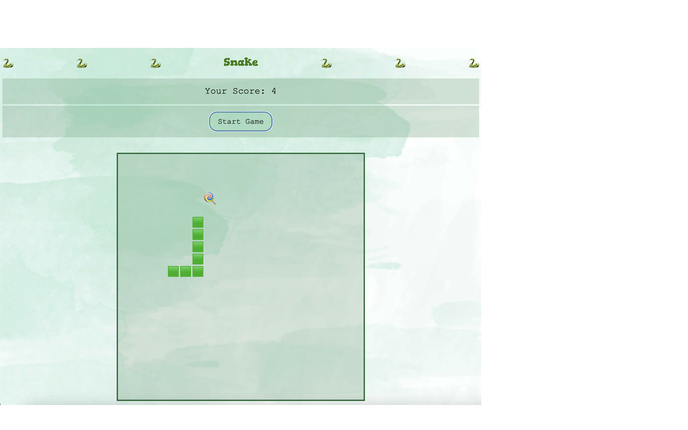

<h1 align='center'> My Simple Browser Based Snake Game 🐍</h1>

A basic game of the classic Snake, written in HTML, CSS and JavaScript.

## How it Looks

## Description
This is a single-player game where you control the snake to eat food that will be randomly placed on the screen. Your snake will keep growing longer with each piece of food it eats and will also get faster to make the game increasingly challenging.
The game ends if the snake collides either with the walls or with itself - the aim is to survive for as long as possible.

### How to Play
Press the ⬆️ key to change the direction to upwards.

Press the ⬇️ key to change the direction to downwards.

Press the ⬅️ key to change the direction to left.

Press the ➡️ key to change the direction to right.

A fun game to play and a good example for a first time build with JavaScript!

## Requirements / Brief
The snake should be able to eat food to grow bigger.

The game should end when the snake hits the wall or itself.

Snake speeds up as it eats more.

## Deployment link to play my game

(Link Here)

## Getting Started / Code Installation

Fill

## Time Frame and Team

Fill

## Technologies Used

JavaScript, HTML, CSS.

## Planning

Fill

### Pseudocode

/*-------------------------------- HTML --------------------------------*/

// Title  
// Grid for the section in which the game is played  
// Start button  
// Restart button  
// Score display  
// Score / Lose statment display  
// Highscore  

/*-------------------------------- Variables --------------------------------*/

// Snake Position - will be represented by an array to determine where it shows on the screen - index for each cell  
// Snake length - number of parts of the segments currently  
// The Food - coordinate of where the next piece of food shows up  
// Players Score - will carry the number of food items eaten  
// Speed - will determine how fast the snake moves (set using an interval time)  
// Play state - boolean to determine win \ lose (whether the game is still going)  
// Direction - will carry upwards, downwards, left or right, controlled by the keyboard arrows  

/*------------------------ Cached Element References ------------------------*/

// Start button  
// Score Display  
// Grid section of the game  
// Display section for a Loss  

/*-------------------------------- Functions --------------------------------*/

// Initialise game  
//  1 Score at 0  
//  2 Snake position on left of the screen  
//  3 Snake direction moving towards the right of the screen  
//  4 Random placement of the first piece of food  
//  5 Snake length starts at three segments  
//  6 Initial speed of the snake measured by time interval of the loop  

// Draw grid  
//  For loop to create a div for each element  
//  Grid size 20x20  

// Show snake  
//  1 For each element of the snake array add the class snake  

// Placing the food  
//  1 Random select of a position for the next piece of food  

// Eat food  
//  1 Food disappears if head collides with it  
//  2 Score increases by 1  
//  3 Return true if the food was eaten and return false if not  
//  4 Snake speed increases (reduce interval)  

//  Collision checks  
//  1 Create variables to hold condition for hitting any of the four walls  
//  2 Create variable to hold condition for the snake hitting itself  
//  3 Return true if any of these conditions are true  

// Moving the snake  
//  1 Clear any previous snake  
//  2 The new head of the snake will be the current head plus the direction  
//  3 Check for a collision and if true then exit the function and display you lose  
//  4 If not, add new head position to the beginning of the snake array  
//  5 Check if food was eaten, if not remove the tail of the snake  

/*----------------------------- Event Listeners -----------------------------*/

// Detect key presses on arrows to change direction  
// Player cannot immediately move from up to down or left to right or vice versa  
// Start button click to initialise game  

## Build Process

Fill

## Challenges

Fill

## Wins

Fill

## Key Takeaways

Fill

## Bugs

Fill

## Next Steps

1 Responsive Design

2 Multiplayer Mode

3 High Score Table